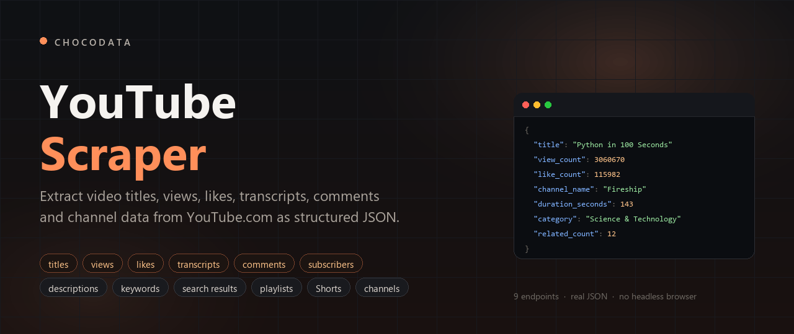
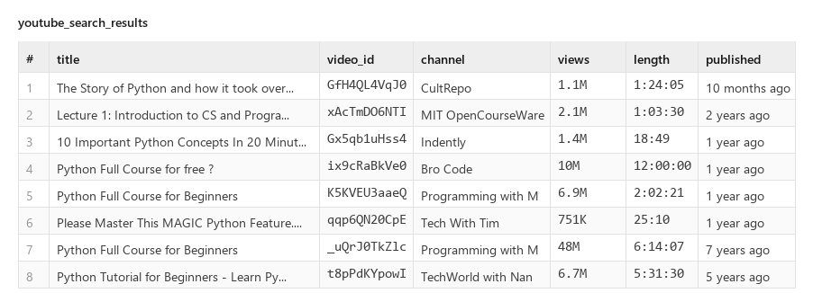
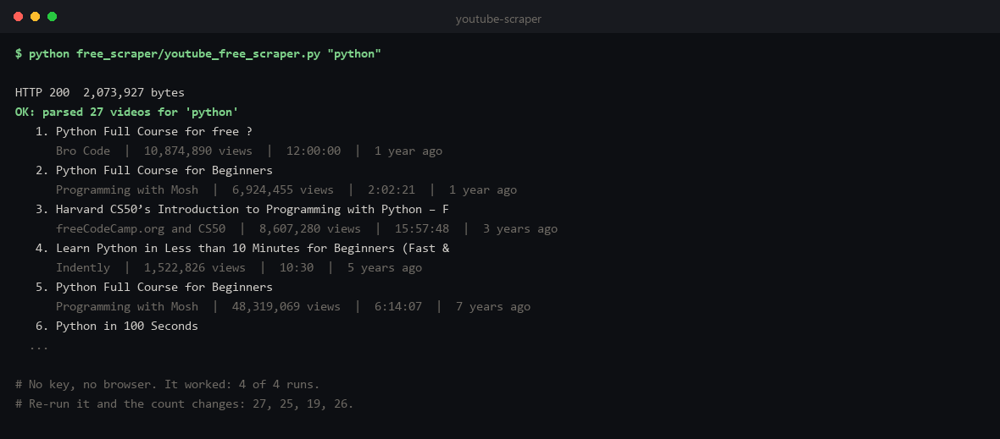
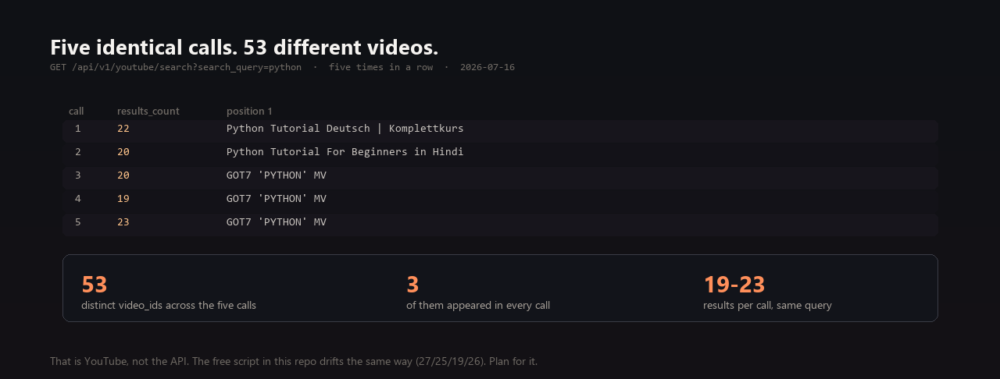
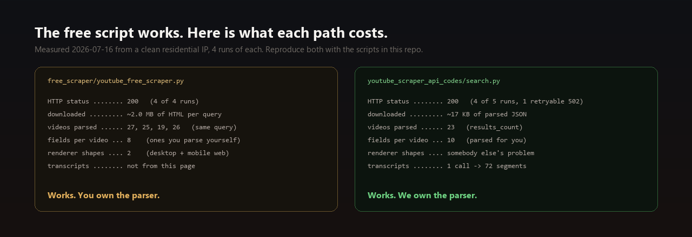
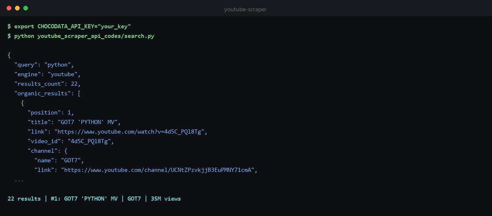
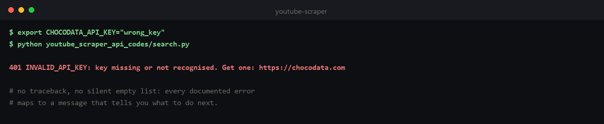
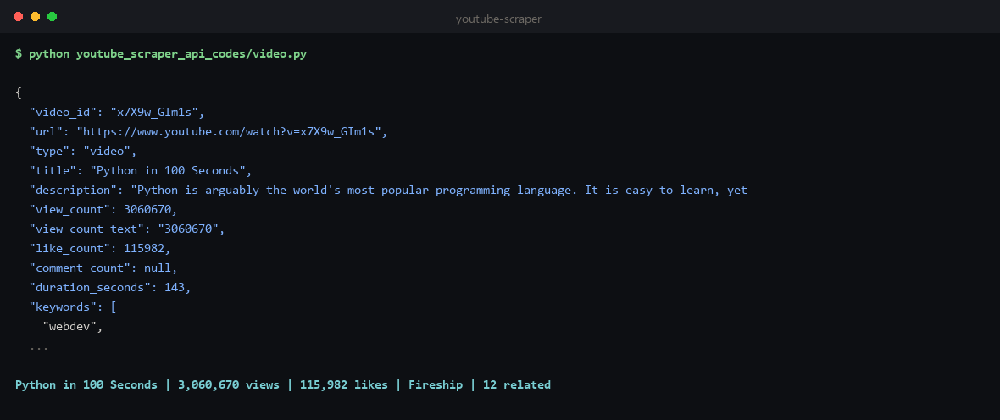
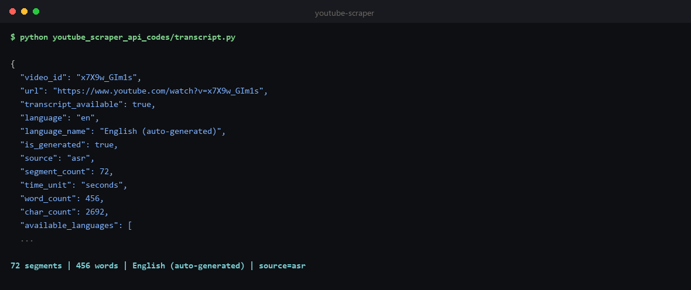
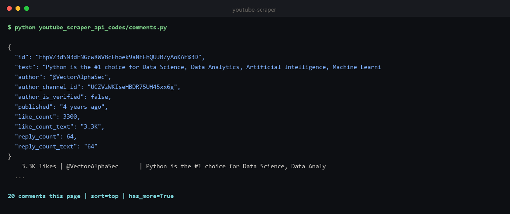

# YouTube Scraper



**YouTube Scraper for extracting video titles, views, likes, channels, subscribers, descriptions and search results from YouTube.com.** This repo has a free YouTube web scraping script you can run right now, and a YouTube data API with 9 endpoints returning real structured JSON, including transcripts and comments.

**Last updated: 2026-07-16.** Working against YouTube.com as of July 2026, and re-verified whenever YouTube changes their markup.

Every JSON block on this page was captured from the live API on 2026-07-16. Long arrays are trimmed to the first item or two (each block says exactly what was cut); **every field shown is verbatim**, nothing is rewritten, padded, or invented. Full uncut samples are committed in [`youtube_scraper_api_data/`](youtube_scraper_api_data), so you can diff this page against them. Every code example calls the actual API and is runnable from [`youtube_scraper_api_codes/`](youtube_scraper_api_codes).

```bash
pip install requests
export CHOCODATA_API_KEY="your_key"     # free: 1,000 requests, one-time, no card
python youtube_scraper_api_codes/video.py
```

Those three lines return this, live from YouTube.com:

```json
{
  "title": "Python in 100 Seconds",
  "view_count": 3060670,
  "like_count": 115982,
  "duration_seconds": 143,
  "category": "Science & Technology",
  "keywords": ["webdev", "app development", "lesson", "tutorial"],
  "channel_name": "Fireship",
  "publish_date": "2021-10-25T08:19:28-07:00",
  "related_count": 12
}
```

That is 26 fields for one video. Swap the script for `search.py` and you get 23 videos with 10 fields each:



That is the whole point of this repo. The rest of this page is how it works, what it costs, and where it stops.

---

## Contents

- [Free YouTube Scraper](#free-youtube-scraper)
- [Avoid getting blocked when scraping YouTube](#avoid-getting-blocked-when-scraping-youtube)
  - [Using the Chocodata YouTube Scraper API](#using-the-chocodata-youtube-scraper-api)
- [YouTube Scraper API reference](#youtube-scraper-api-reference)
  - [Quickstart](#quickstart) · [Authentication](#authentication) · [Global parameters](#global-parameters) · [Errors](#errors) · [Rate limits and concurrency](#rate-limits-and-concurrency)
  - [1. Search](#1-search-video-listings-channels-views-and-durations) · [2. Video](#2-video-titles-views-likes-descriptions-and-keywords) · [3. Transcript](#3-transcript-video-captions-and-subtitles-as-text) · [4. Comments](#4-comments-comment-text-authors-likes-and-replies) · [5. Channel](#5-channel-subscribers-video-listings-and-channel-metadata) · [6. Playlist](#6-playlist-playlist-videos-and-metadata) · [7. Shorts](#7-shorts-youtube-shorts-views-likes-and-duration) · [8. Suggest](#8-suggest-youtube-keyword-research-data)
- [Channel performance tracking: a real use case](#channel-performance-tracking-a-real-use-case)
- [Build vs buy: what this actually costs](#build-vs-buy-what-this-actually-costs)
- [Measured latency](#measured-latency)

---

## Free YouTube Scraper

YouTube server-renders its search results into a `ytInitialData` JSON blob, so when a request gets through you can extract structured data from YouTube search pages without a headless browser or JavaScript rendering. No key, no cost:

```bash
python free_scraper/youtube_free_scraper.py "python"
```

Source: [`free_scraper/youtube_free_scraper.py`](free_scraper/youtube_free_scraper.py). It finds the `ytInitialData` blob, walks it for every video renderer, and emits `video_id, title, url, channel, views, published, length`.

After running the command, your terminal should look something like this:



**It works.** We ran it 4 times from a clean residential IP while writing this README and it was not blocked once: HTTP 200, ~2 MB of HTML, real videos parsed every time. If you came here expecting a story about CAPTCHAs, the honest version is that YouTube let a plain Python script in, and for a lot of jobs that script is all you need.

So the next section is not "here is how you get past the wall". It is the more useful question: what actually goes wrong.

## Avoid getting blocked when scraping YouTube

Getting blocked is not the interesting failure mode on YouTube. These are, and all of them are measured, not asserted.

**First, the trap that ruins naive block detection.** The strings `captcha` and `consent.youtube` are present in the HTML of a page that returned perfectly good data. Every single successful run above contains them, because YouTube ships that JavaScript on healthy pages. A scraper that greps the body for those words concludes "blocked" on a page full of results, and can never report success. The rule that falls out of it: **parse first, and only call it a block when the data is genuinely absent.** The script in this repo does it in that order on purpose.

**Second, the results are not stable.** This is the one that will actually cost you. Five identical calls, same endpoint, same query, seconds apart:



53 distinct videos across five calls. **Three** of them appeared in all five. The free script drifts exactly the same way (27, 25, 19, 26 videos on four runs), so this is YouTube's behaviour, not an artifact of either scraper. If your plan was "scrape the top 10 for a keyword and diff it against yesterday", that plan does not survive contact with YouTube: you need repeated samples and aggregation, not one call.

It also means **your output will not match the JSON on this page**, and that is expected. Re-run it and it will not match itself either.

**Third, it depends on the route.** Search and watch pages came back clean. The channel playlists route did not, 3 fetches out of 3:

| What we measured (plain fetch, `/@fireship/playlists`) | Value |
|---|---|
| HTTP status | **200** (not 403, not 429) |
| Response size | **583,863 bytes** |
| `<title>` | **`Before you continue to YouTube`** |
| `ytInitialData` blob | **absent** |
| Playlist ids found | **0** |

A 200 with a consent interstitial and no data is the same silent failure a bot check would give you: nothing crashes, you just get zero rows and log "no results".

Here is the full picture, and what each item costs you:

| What bites you | Why | What it costs you |
|---|---|---|
| **HTTP 200 is not success** | The consent interstitial and the bot check both return `200`. A naive scraper parses it, finds nothing, and logs "0 results" rather than "blocked". | The expensive failure is not a crash. It is three weeks of empty data that looked like "no results". |
| **Anti-bot strings on good pages** | `captcha` and `consent.youtube` appear in healthy responses. | Substring block-detection false-positives, and you never notice because it fails toward "blocked". |
| **Non-deterministic result sets** | Same query, 19 to 23 results, 53 distinct videos over 5 calls. | Rank tracking and diffing need many samples. One call is noise. |
| **Multiple renderer shapes** | The video list arrives as `videoRenderer` (desktop) or `videoWithContextRenderer` (mobile web) for the same URL, and channel grids add `lockupViewModel`. | Your parser handles one shape, silently returns `[]` for the others, and looks like a block. |
| **~2 MB of HTML per query** | A YouTube search page is heavy. | At residential proxy rates this is the dominant cost of DIY at scale. See [Build vs buy](#build-vs-buy-what-this-actually-costs). |
| **The JSON path moves** | `ytInitialData` shapes change. Your parser silently returns `[]`. | Ongoing maintenance, plus alerting smart enough to tell "empty" from "broken". |

What we did **not** measure, and so will not claim: datacenter egress, and sustained high volume from one IP. We tested one residential IP at low volume. If someone tells you what happens at 100k requests/day without showing you the run, they are guessing.

So the two paths, side by side, same query, same day:



Both work. The difference is not access, it is what you carry: ~2 MB of HTML and a parser that has to know every renderer shape YouTube ships, versus ~17 KB of JSON with the fields already named.

---

### Using the Chocodata YouTube Scraper API

The managed option, and the one this repo is built around. Nine endpoints for YouTube data extraction at scale, eight of them documented below (search, video, transcript, comments, channel, playlist, Shorts and suggest), a ~99% success rate, one JSON shape whichever renderer YouTube serves, and no proxy management. Free for the first 1,000 requests.

Read [Build vs buy](#build-vs-buy-what-this-actually-costs) first. For some jobs the right answer is Google's own free API, and that section says so plainly.

---

## YouTube Scraper API reference

Every response below is real. No login, no browser.

### Quickstart

```bash
curl "https://api.chocodata.com/api/v1/youtube/search?api_key=YOUR_KEY&search_query=python"
```

```python
import requests

r = requests.get(
    "https://api.chocodata.com/api/v1/youtube/search",
    params={"api_key": "YOUR_KEY", "search_query": "python"},
    timeout=90,
)
top = r.json()["organic_results"][0]
print(top["title"], top["views"])
# The Story of Python and how it took over the world | Python: The Documentary 1.1M views
```

After running the command, your terminal should look something like this:



Note the top result in that screenshot is a K-pop music video, because `python` is genuinely ambiguous on YouTube and that is what the endpoint returned. We left it in rather than pick a flattering query.

Get a key at [chocodata.com](https://chocodata.com) (1,000 requests, one-time, no card).

### Authentication

Pass `api_key` as a query parameter on every request. That is the whole auth model. No OAuth, and no "log in as the channel owner", which is the part of Google's official API that stops most third-party projects.

### Global parameters

| Param | Type | Required | Default | Description |
|---|---|---|---|---|
| `api_key` | string | yes | - | Your Chocodata API key. Every endpoint. |
| `country` | string (ISO-2) | no | `US` | Egress location. Accepted by `channel`, `transcript` and `comments` only. |

That table is short on purpose. **Each endpoint takes the parameters listed in its own section and silently ignores anything else**, so `&page=2` on `/youtube/search` does not error, it just does nothing. There is no `add_html` on these endpoints: we tested it, and the response is identical.

Each request costs **5 credits (= 1 request)**. Responses are billed only on success (2xx).

### Errors

Real captured error bodies, not paraphrases. Nothing below is billed: **you are only charged on a 2xx**.

| Status | `error` code | Meaning | Billed | What to do |
|---|---|---|---|---|
| `400` | `invalid_params` | A required param is missing or the wrong type. Body lists the exact issue and `path`. | no | Fix the query string. |
| `401` | `INVALID_API_KEY` | Key missing, unrecognised, or revoked. | no | Check `api_key`. Get one at [chocodata.com](https://chocodata.com). |
| `402` | `INSUFFICIENT_CREDITS` | Balance exhausted. | no | Top up ($0.90 / 1,000 requests, never expires) or upgrade. |
| `429` | `RATE_LIMITED` | Over your plan's concurrency. | no | Back off and retry; see [Rate limits](#rate-limits-and-concurrency). |
| `502` | `target_unreachable` | YouTube refused every attempt for this request. `retryable: true`. | no | Retry. |
| `502` | `extraction_failed` | The page loaded but carried no data: a dead video id, comments disabled, or the shape moved. | no | Check the id first. If the id is good, retry, then report it. |

The scripts in this repo map every documented status onto an actionable message, so a typo'd key does not hand you a stack trace:



A bad key, verbatim:

```bash
curl "https://api.chocodata.com/api/v1/youtube/search?api_key=totally_invalid_key_123&search_query=python"
```
```json
{"error":{"code":"INVALID_API_KEY","message":"Api key not recognised."}}
```

A missing required param, verbatim. Note it names the real param, which is the fastest way to find out that search takes `search_query` and not `q`:

```json
{"error":"invalid_params","issues":[{"code":"invalid_type","expected":"string","received":"undefined","path":["search_query"],"message":"Required"}]}
```

Two response shapes exist: auth/billing errors nest under `error.code` (uppercase), while scrape-layer errors are flat with a lowercase `error` string.

**Honest note on 502s.** They are real and you will see them. While measuring the latency table below, 1 of 5 `search` calls and 1 of 5 `channel` calls came back `502` and had to be retried. That is the number, from the same run that produced the medians.

### Rate limits and concurrency

There is no per-minute request cap. The limit is **concurrency**: how many requests you may have in flight at once.

| Plan | Concurrent requests |
|---|---|
| Free | 10 |
| Vibe | 30 |
| Pro | 50 |
| Custom | 100 to 500+ |

Exceed it and you get `429`, not a queue. Every endpoint is a **synchronous GET**: there is no webhook, callback, or async job to poll. The examples use `timeout=90` because the slowest call we measured took 12.4s and you want headroom.

Sizing: at Pro (50 concurrent) and a ~2.5s median search, one worker pool sustains roughly 50 / 2.5 = **20 requests/second**. Fan out with a thread pool:

```python
from concurrent.futures import ThreadPoolExecutor
import requests

def one(q):
    r = requests.get("https://api.chocodata.com/api/v1/youtube/search",
                     params={"api_key": KEY, "search_query": q}, timeout=90)
    return q, (r.json().get("organic_results", []) if r.ok else [])

queries = ["python", "rust", "golang", "typescript", "zig"]
with ThreadPoolExecutor(max_workers=10) as pool:   # <= your plan's concurrency
    for q, results in pool.map(one, queries):
        print(q, len(results))
```

---

### 1. Search: video listings, channels, views and durations

Ranked YouTube search results for a keyword, with the channel block, view count, duration and thumbnails. Promoted results come back separately in `ads`.

| Param | Type | Required | Default | Description |
|---|---|---|---|---|
| `search_query` | string | **yes** | - | Search keywords. Note the name: it is `search_query`, not `q`. |

**Ceiling, read this before you buy:** this is the one page YouTube renders for that query. There is **no `page` parameter, no pagination, and no `country` or `language` control**: you get whatever YouTube served, in whatever locale it decided. Across five identical calls for `python` we saw German and Hindi tutorials take position 1, and the row count move between 19 and 23. See [the drift section](#avoid-getting-blocked-when-scraping-youtube) before you build on this.

```bash
curl "https://api.chocodata.com/api/v1/youtube/search?api_key=YOUR_KEY&search_query=python"
```

**Real response.** `organic_results` cut to 1 of 23; the row object itself is complete, all 10 fields verbatim ([full sample](youtube_scraper_api_data/search.json)):

```json
{
  "query": "python",
  "engine": "youtube",
  "results_count": 23,
  "organic_results": [
    {
      "position": 1,
      "title": "The Story of Python and how it took over the world | Python: The Documentary",
      "link": "https://www.youtube.com/watch?v=GfH4QL4VqJ0",
      "video_id": "GfH4QL4VqJ0",
      "channel": {
        "name": "CultRepo ",
        "link": "https://www.youtube.com/channel/UCsUalyRg43M8D60mtHe6YcA",
        "thumbnail": "https://yt3.ggpht.com/P2Ey1tJoDU5pTVRuoT7a1HZ_-dNCJB977U_STsHVhLT8DEdydgCk0f_uDYA4WFnpDpWrdZqvyVM=s68-c-k-c0x00ffffff-no-rj",
        "verified": false
      },
      "views": "1.1M views",
      "published": "10 months ago",
      "length": "1:24:05",
      "description": null,
      "thumbnail": {
        "static": "https://i.ytimg.com/vi/GfH4QL4VqJ0/hq720.jpg?sqp=-oaymwEhCK4FEIIDSFryq4qpAxMIARUAAAAAGAElAADIQj0AgKJD&rs=AOn4CLDw5nTMyUcRJBugl4ao4BYgx34Wig",
        "rich": "https://i.ytimg.com/an_webp/GfH4QL4VqJ0/mqdefault_6s.webp?du=3000&sqp=CMzT5NIG&rs=AOn4CLAlJ900NLFjb-NxUwDwW_rQJaeXhg"
      }
    }
  ],
  "ads": [],
  "ads_count": 0
}
```

`views` is display text (`"1.1M views"`), not an integer: YouTube does not ship a precise number on the search surface, so we return the string it rendered rather than fake precision by expanding it. If you need the exact count, call [`/youtube/video`](#2-video-titles-views-likes-descriptions-and-keywords), which does. `description` is `null` here and often is: the mobile-web layout omits the snippet entirely. The trailing space in `"CultRepo "` is YouTube's, and we do not trim it for you. `ads: []` is the normal case on a logged-out search.

Runnable: [`youtube_scraper_api_codes/search.py`](youtube_scraper_api_codes/search.py)

---

### 2. Video: titles, views, likes, descriptions and keywords

The full record for one video: exact view and like counts, the complete description, upload dates, channel, thumbnails, and a related list.

| Param | Type | Required | Default | Description |
|---|---|---|---|---|
| `video_id` | string | one of `video_id`/`url` | - | The 11-char watch id (e.g. `x7X9w_GIm1s`), or any video URL. Note the name: `video_id`, not `id`. |
| `url` | string (URL) | one of `video_id`/`url` | - | `watch?v=`, `youtu.be/`, `/shorts/`, `/embed/` all work. |

```bash
curl "https://api.chocodata.com/api/v1/youtube/video?api_key=YOUR_KEY&video_id=x7X9w_GIm1s"
```

**Real response.** `related` cut to 1 of 12, `thumbnails` to 1 of 5, `description` truncated from 770 chars where marked; every one of the 26 fields is present and verbatim ([full sample](youtube_scraper_api_data/video.json)):

```json
{
  "video_id": "x7X9w_GIm1s",
  "url": "https://www.youtube.com/watch?v=x7X9w_GIm1s",
  "type": "video",
  "title": "Python in 100 Seconds",
  "description": "Python is arguably the world's most popular programming language. It is easy to learn, yet suitable in professional so...",
  "view_count": 3060670,
  "view_count_text": "3060670",
  "like_count": 115982,
  "comment_count": null,
  "duration_seconds": 143,
  "keywords": ["webdev", "app development", "lesson", "tutorial"],
  "category": "Science & Technology",
  "is_live": false,
  "is_family_safe": true,
  "is_private": false,
  "allow_ratings": true,
  "publish_date": "2021-10-25T08:19:28-07:00",
  "upload_date": "2021-10-25T08:19:28-07:00",
  "channel_id": "UCsBjURrPoezykLs9EqgamOA",
  "channel_name": "Fireship",
  "channel_handle": "http://www.youtube.com/@Fireship",
  "channel_url": "https://www.youtube.com/channel/UCsBjURrPoezykLs9EqgamOA",
  "thumbnail": "https://i.ytimg.com/vi/x7X9w_GIm1s/hq720.jpg?sqp=-oaymwEhCK4FEIIDSFryq4qpAxMIARUAAAAAGAElAADIQj0AgKJD&rs=AOn4CLCrVjDSaMXGhMyxCQgh8JEAbsBJcw",
  "thumbnails": [
    { "url": "https://i.ytimg.com/vi/x7X9w_GIm1s/default.jpg", "width": 120, "height": 90 }
  ],
  "related": [
    {
      "position": 1,
      "id": "l9AzO1FMgM8",
      "title": "Java in 100 Seconds",
      "url": "https://www.youtube.com/watch?v=l9AzO1FMgM8",
      "thumbnail": "https://i.ytimg.com/vi/l9AzO1FMgM8/hq720.jpg?sqp=-oaymwEhCK4FEIIDSFryq4qpAxMIARUAAAAAGAElAADIQj0AgKJD&rs=AOn4CLAtFYjsSas389w4jX_BdgYl1vncmA",
      "channel": "Fireship",
      "views": "1.6M views",
      "published": null
    }
  ],
  "related_count": 12
}
```



`view_count` is the field most people come for, and it is the one place you get an exact integer instead of `"3M views"`. It is genuinely live: we called this endpoint on a 6-day-old Short twice, 60 seconds apart, and got **69,656,373 then 69,656,393**, a real +20. On this 4-year-old video it returned the identical number on 5 consecutive calls, because the video is not actually gaining a view per second. Both of those are the truth, and the second one is why we are not going to sell you "real-time" as a feature.

Three honest notes on the rest:

- **`comment_count` is `null`.** YouTube does not ship the comment count in the watch page's initial HTML: it arrives later over a separate request. We return `null` rather than invent it. The count is not available from [`/youtube/comments`](#4-comments-comment-text-authors-likes-and-replies) either, which reports `comment_count: null` for the same reason.
- **`related[]` is not a stable graph.** Five calls to this endpoint returned five different orderings and **36 distinct videos** across 12 rows each. Only position 1 held. Two of those captures are committed ([video.json](youtube_scraper_api_data/video.json), [video_repeat.json](youtube_scraper_api_data/video_repeat.json)) so you can diff them, and running the script twice reproduces it. Do not build a recommendation graph out of one call.
- **`keywords` is often `[]`.** It is the uploader's tag list, and most uploaders leave it empty. It is populated here; do not count on it.

Runnable: [`youtube_scraper_api_codes/video.py`](youtube_scraper_api_codes/video.py)

---

### 3. Transcript: video captions and subtitles as text

The captions for any public video, as timed segments and as one plain-text blob. This is the endpoint that has no equivalent in Google's official API: `captions.download` there "requires the user to have permission to edit the video", so it only works on videos you own.

| Param | Type | Required | Default | Description |
|---|---|---|---|---|
| `video_id` | string | one of `video_id`/`url` | - | The 11-char watch id, or any video URL. |
| `url` | string (URL) | one of `video_id`/`url` | - | Alias for the above. |
| `lang` | string | no | `en` | Caption language code. Falls back to the first available track. |
| `format` | enum | no | `both` | `segments`, `text`, or `both`. |
| `units` | enum | no | `seconds` | `seconds` (3 decimals) or `ms` (raw integers). |
| `country` | string (ISO-2) | no | `US` | Egress location. |

```bash
curl "https://api.chocodata.com/api/v1/youtube/transcript?api_key=YOUR_KEY&video_id=x7X9w_GIm1s"
```

**Real response.** `segments` cut to 3 of 72 and `text` truncated from 2,692 chars; all 14 fields present and verbatim ([full sample](youtube_scraper_api_data/transcript.json)):

```json
{
  "video_id": "x7X9w_GIm1s",
  "url": "https://www.youtube.com/watch?v=x7X9w_GIm1s",
  "transcript_available": true,
  "language": "en",
  "language_name": "English (auto-generated)",
  "is_generated": true,
  "source": "asr",
  "segment_count": 72,
  "time_unit": "seconds",
  "word_count": 456,
  "char_count": 2692,
  "available_languages": ["en"],
  "segments": [
    { "text": "python a highlevel interpreted", "start": 0.16, "duration": 4.08 },
    { "text": "programming language famous for its", "start": 2.36, "duration": 4.08 },
    { "text": "zen-like code it's arguably the most", "start": 4.24, "duration": 3.88 }
  ],
  "text": "python a highlevel interpreted programming language famous for its zen-like code it..."
}
```



`source: "asr"` is the field to check before you trust the text: `asr` means YouTube's speech recognition wrote it, not a human, and it shows. Look at the segments above: no punctuation, no capitalisation, and `start` values that overlap (segment 2 starts at 2.36 while segment 1 runs to 4.24) because the captions are painted in a rolling window rather than as clean subtitle blocks. If you are feeding an LLM, use `text` and do not worry about it. If you are building a subtitle file, you will have to merge the overlaps yourself.

**Ceiling:** a video with no captions is **not an error**. You get `200` with `transcript_available: false` and a `reason` (`transcripts_disabled`, `none_found`, `members_only`, `age_restricted`, `video_unavailable`), and you are charged for it, because we did the work of finding out. Check that field before reading `segments`; the example script does.

Runnable: [`youtube_scraper_api_codes/transcript.py`](youtube_scraper_api_codes/transcript.py)

---

### 4. Comments: comment text, authors, likes and replies

One page of comments with author, like count, reply count and relative date, plus a cursor for the next page.

| Param | Type | Required | Default | Description |
|---|---|---|---|---|
| `video_id` | string | one of these | - | The 11-char watch id, or any video URL. |
| `url` | string (URL) | one of these | - | Alias for the above. |
| `page_token` | string | one of these | - | Cursor from a previous response. Fetches exactly one more page. |
| `sort` | enum | no | `top` | `top` or `newest`. See the note below. |
| `country` | string (ISO-2) | no | `US` | Egress location. |

```bash
curl "https://api.chocodata.com/api/v1/youtube/comments?api_key=YOUR_KEY&video_id=x7X9w_GIm1s"
```

**Real response.** `comments` cut to 1 of 20 and the tokens truncated where marked; the comment object is complete, all 10 fields verbatim ([full sample](youtube_scraper_api_data/comments.json)):

```json
{
  "video_id": "x7X9w_GIm1s",
  "url": "https://www.youtube.com/watch?v=x7X9w_GIm1s",
  "page": 1,
  "sort_applied": "top",
  "comment_count": null,
  "comment_count_text": null,
  "results_count": 20,
  "comments": [
    {
      "id": "EhpVZ3dSN3dENGcwRWVBcFhoek9aNEFhQUJBZyAoKAE%3D",
      "text": "Python is the #1 choice for Data Science, Data Analytics, Artificial Intelligence, Machine Learning, Computer Vision, Natural Language Processing and so much more as well as heavilly used in backend server side web development. It's a nice language. Really having a fun time learning it compared to my most known languages like C, C++ and Java.",
      "author": "@VectorAlphaSec",
      "author_channel_id": "UCZVzWKIseHBDR75UH45xx6g",
      "author_is_verified": false,
      "published": "4 years ago",
      "like_count": 3300,
      "like_count_text": "3.3K",
      "reply_count": 64,
      "reply_count_text": "64"
    }
  ],
  "next_page_token": "eyJjIjoiRWcwU0MzZzNXRGwz...",
  "next_page_url": "/api/v1/youtube/comments?page_token=eyJjIjoi...",
  "has_more": true
}
```



`like_count: 3300` is the expanded integer and `like_count_text: "3.3K"` is what YouTube actually rendered. Keep that distinction in mind: the page only ever showed two significant figures, so the true count is somewhere in a ~100-wide band and **`like_count` is precise-looking but not precise**. We keep both fields so you can see which one YouTube actually said. `published` is relative text (`"4 years ago"`), never a timestamp, because that is all the page carries.

**Ceiling, read this before you buy:** 20 comments per call, and `comment_count` is `null` (see the video endpoint note). Pagination is a cursor: pass `next_page_token` back to get the next 20, one call each. So "export all 4,000 comments" is 200 calls, not one, and there is no bulk mode. Also: **`sort=newest` may silently fall back to `top`**. The sort token only exists after the first page loads, so check `sort_applied` in the response rather than assuming you got what you asked for. And a video with comments disabled returns a `502`, not an empty list.

Runnable: [`youtube_scraper_api_codes/comments.py`](youtube_scraper_api_codes/comments.py)

---

### 5. Channel: subscribers, video listings and channel metadata

Channel profile, subscriber count, and a page of the channel's videos with per-video view counts.

| Param | Type | Required | Default | Description |
|---|---|---|---|---|
| `channel` | string | one of these | - | `@handle`, bare handle, `UC…` id, `/c/Name`, `/user/Name`, or any channel URL. |
| `page_token` | string | one of these | - | Cursor from a previous response. Fetches exactly one more page. |
| `tab` | enum | no | `videos` | `videos`, `shorts`, `streams`, `about`. See the ceiling. |
| `country` | string (ISO-2) | no | `US` | Egress location. |

```bash
curl "https://api.chocodata.com/api/v1/youtube/channel?api_key=YOUR_KEY&channel=@MrBeast"
```

**Real response.** `videos` cut to 2 of 30, `description` and the page tokens truncated where marked; all 21 fields present ([full sample](youtube_scraper_api_data/channel.json)):

```json
{
  "channel": "MrBeast",
  "channel_id": "UCX6OQ3DkcsbYNE6H8uQQuVA",
  "channel_name": "MrBeast",
  "handle": "@MrBeast",
  "vanity_url": "http://www.youtube.com/@MrBeast",
  "url": "https://www.youtube.com/channel/UCX6OQ3DkcsbYNE6H8uQQuVA",
  "tab": "videos",
  "description": "SUBSCRIBE FOR A COOKIE!\nNew MrBeast or MrBeast Gaming video every sing...",
  "keywords": "mrbeast6000 beast mrbeast Mr.Beast mr",
  "avatar": "https://yt3.googleusercontent.com/nxYrc_1_2f77DoBadyxMTmv7ZpRZapHR5jbuYe7PlPd5cIRJxtNNEYyOC0ZsxaDyJJzXrnJiuDE=s900-c-k-c0x00ffffff-no-rj",
  "is_family_safe": true,
  "subscriber_count": 508000000,
  "subscriber_count_text": "508M subscribers",
  "video_count": 992,
  "video_count_text": "992 videos",
  "videos": [
    {
      "position": 1,
      "id": "iYlODtkyw_I",
      "title": "Survive 30 Days Chained To A Stranger, Win $250,000",
      "url": "https://www.youtube.com/watch?v=iYlODtkyw_I",
      "thumbnail": "https://i.ytimg.com/vi/iYlODtkyw_I/hq720.jpg?sqp=-oaymwEhCK4FEIIDSFryq4qpAxMIARUAAAAAGAElAADIQj0AgKJD&rs=AOn4CLB7AiG1nps9yMHQMJg-9Pji8f3YjA",
      "channel": "MrBeast",
      "views": "72,874,951 views",
      "published": "2 weeks ago"
    },
    {
      "position": 2,
      "id": "__fmDj0ZJ1Q",
      "title": "50 YouTube Legends Fight For $1,000,000",
      "url": "https://www.youtube.com/watch?v=__fmDj0ZJ1Q",
      "thumbnail": "https://i.ytimg.com/vi/__fmDj0ZJ1Q/hq720.jpg?sqp=-oaymwEhCK4FEIIDSFryq4qpAxMIARUAAAAAGAElAADIQj0AgKJD&rs=AOn4CLAYTCBDVSncERnpgfTJUVoe7Z_A3g",
      "channel": "MrBeast",
      "views": "73,250,809 views",
      "published": "1 month ago"
    }
  ],
  "videos_count": 30,
  "page": 1,
  "next_page_token": "eyJjIjoiNHFtRnNnTFpDUklZ...",
  "next_page_url": "/api/v1/youtube/channel?page_token=eyJjIjoiN...",
  "has_more": true
}
```

Note the pair: `subscriber_count: 508000000` next to `subscriber_count_text: "508M subscribers"`. The integer is **not** the real subscriber count, it is `"508M"` expanded. YouTube stopped publishing exact subscriber counts years ago and renders three significant figures, so the true number sits in a band roughly a **million wide** and no public surface can narrow it, ours included. Any API that hands you `508,214,377` is making it up. Per-video `views`, by contrast, arrive as exact strings (`"72,874,951 views"`), which is why the tracker below diffs those and not the subscriber count.

**Ceiling:** 30 videos per call from a 992-video channel, then cursor pagination, one call per page. And **`tab=shorts` returns `videos_count: 0`**: we tested @MrBeast, @mkbhd and @fireship, all of which post Shorts, and got zero rows on all three. The Shorts grid uses a renderer this endpoint does not parse yet. `tab=videos`, `tab=streams` and `tab=about` all return real rows.

Runnable: [`youtube_scraper_api_codes/channel.py`](youtube_scraper_api_codes/channel.py)

---

### 6. Playlist: playlist videos and metadata

A playlist's videos plus its header: title, owner, video count and total views.

| Param | Type | Required | Default | Description |
|---|---|---|---|---|
| `playlist_id` | string | one of `playlist_id`/`url` | - | The playlist id (`PL…`, `UU…`, `FL…`, `RD…`), or any URL with `?list=`. |
| `url` | string (URL) | one of `playlist_id`/`url` | - | Full playlist URL. |

```bash
curl "https://api.chocodata.com/api/v1/youtube/playlist?api_key=YOUR_KEY&playlist_id=PLWKjhJtqVAbkmRvnFmOd4KhDdlK1oIq23"
```

**Real response.** `videos` cut to 2 of 14; all 7 fields present ([full sample](youtube_scraper_api_data/playlist.json)):

```json
{
  "playlist_id": "PLWKjhJtqVAbkmRvnFmOd4KhDdlK1oIq23",
  "title": "Python Basics with Sam",
  "channel": "freeCodeCamp.org",
  "video_count": 14,
  "views": 518685,
  "videos": [
    {
      "position": 1,
      "id": "z2k9Jh3jDVU",
      "title": "Intro to Python Livestream - Python Basics with Sam",
      "url": "https://www.youtube.com/watch?v=z2k9Jh3jDVU",
      "thumbnail": "https://i.ytimg.com/vi/z2k9Jh3jDVU/hq720.jpg?sqp=-oaymwEcCK4FEIIDSEbyq4qpAw4IARUAAIhCGAFwAcABBg==&rs=AOn4CLB0NJYTnwJAAACWrUhRC6VHohSSMA",
      "channel": "freeCodeCamp.org",
      "views": "471K views",
      "published": "Streamed 6 years ago"
    },
    {
      "position": 2,
      "id": "4UuMrebbwIo",
      "title": "Python For Loops, Functions, and Random - Python Basics with Sam",
      "url": "https://www.youtube.com/watch?v=4UuMrebbwIo",
      "thumbnail": "https://i.ytimg.com/vi/4UuMrebbwIo/hq720.jpg?sqp=-oaymwEcCK4FEIIDSEbyq4qpAw4IARUAAIhCGAFwAcABBg==&rs=AOn4CLCbBQHHzFzwwMFjr56q2t565etj2w",
      "channel": "freeCodeCamp.org",
      "views": "96K views",
      "published": "Streamed 6 years ago"
    }
  ],
  "videos_returned": 14
}
```

`channel` is only filled in when every video in the playlist has the same uploader; a mixed or curated playlist returns `null` there rather than a guess.

**Ceiling, and this one is sharp:** there is **no `page` parameter and no cursor on this endpoint**, and a long playlist comes back **capped at 20 rows**. We measured MrBeast's uploads playlist (992 videos) and freeCodeCamp's (2.2K videos): both returned exactly 20.

Worse, on those two the response reads `video_count: 20`. **That is not the playlist's size, it is the number of rows we got.** A channel's uploads playlist (the `UU…` form) is auto-generated and carries no header, so `title` and `views` come back `null` and `video_count` falls back to counting the rows returned. Do not treat that field as the playlist length unless `title` is also populated, as it is in the 14-video sample above where `video_count` genuinely is 14.

If you need a channel's full catalogue, this endpoint will not give it to you. Use [`/youtube/channel`](#5-channel-subscribers-video-listings-and-channel-metadata), which returns 30 per call and has a real cursor.

Runnable: [`youtube_scraper_api_codes/playlist.py`](youtube_scraper_api_codes/playlist.py)

---

### 7. Shorts: YouTube Shorts views, likes and duration

One Short, as a full video record with `is_short: true`. A Short is a vertical video on a normal watch page, so this returns the same 26 fields as [`/youtube/video`](#2-video-titles-views-likes-descriptions-and-keywords) plus that flag.

| Param | Type | Required | Default | Description |
|---|---|---|---|---|
| `video_id` | string | one of `video_id`/`url` | - | The 11-char id, or any `/shorts/<id>` URL. |
| `url` | string (URL) | one of `video_id`/`url` | - | Alias for the above. |

```bash
curl "https://api.chocodata.com/api/v1/youtube/shorts?api_key=YOUR_KEY&video_id=egvLKQe6I4I"
```

**Real response.** `related` cut to 1 of 12 and `thumbnails` to 1 of 5; all 27 fields present ([full sample](youtube_scraper_api_data/shorts.json)):

```json
{
  "video_id": "egvLKQe6I4I",
  "url": "https://www.youtube.com/watch?v=egvLKQe6I4I",
  "type": "video",
  "title": "Don't Pop the Balloon",
  "description": "",
  "view_count": 69639387,
  "view_count_text": "69639387",
  "like_count": 1895583,
  "comment_count": null,
  "duration_seconds": 51,
  "keywords": [],
  "category": "Entertainment",
  "is_live": false,
  "is_family_safe": true,
  "is_private": false,
  "allow_ratings": true,
  "publish_date": "2026-07-10T09:00:09-07:00",
  "upload_date": "2026-07-10T09:00:09-07:00",
  "channel_id": "UCX6OQ3DkcsbYNE6H8uQQuVA",
  "channel_name": "MrBeast",
  "channel_handle": "http://www.youtube.com/@MrBeast",
  "channel_url": "https://www.youtube.com/channel/UCX6OQ3DkcsbYNE6H8uQQuVA",
  "thumbnail": "https://i.ytimg.com/vi/egvLKQe6I4I/hq720.jpg?sqp=-oaymwE2CK4FEIIDSEbyq4qpAygIARUAAIhCGABwAcABBvABAfgBtgiAAoAPigIMCAAQARhlIGEoMTAP&rs=AOn4CLCMRrxP7eOLSzB_nbWP3hj5WT_svw",
  "thumbnails": [
    {
      "url": "https://i.ytimg.com/vi/egvLKQe6I4I/default.jpg?sqp=-oaymwEmCHgQWvKriqkDHBgA8AEB-AG2CIACgA-KAgwIABABGGUgYSgxMA8=&rs=AOn4CLBLWWw6MDMlgHEXrVmOPU5aCGTLFw",
      "width": 120,
      "height": 90
    }
  ],
  "related": [
    {
      "position": 1,
      "id": "QF5YpZI1wnk",
      "title": "I Survived 100 Days in Skyblock",
      "url": "https://www.youtube.com/watch?v=QF5YpZI1wnk",
      "thumbnail": "https://i.ytimg.com/vi/QF5YpZI1wnk/hq720.jpg?sqp=-oaymwEcCK4FEIIDSEbyq4qpAw4IARUAAIhCGAFwAcABBg==&rs=AOn4CLDg8hSMO5cD395ERx5_AfqsG6IcOw",
      "channel": "MrBeast Gaming",
      "views": "83M views",
      "published": null
    }
  ],
  "related_count": 12,
  "is_short": true
}
```

`description: ""` and `keywords: []` are real: Shorts are usually posted with neither, so code against empty rather than expecting text. This id is also the one we used for the live-counter check in the [video section](#2-video-titles-views-likes-descriptions-and-keywords): 69.6M views on a Short published six days earlier, moving +20 in 60 seconds.

**Ceiling:** this takes a Short you already know the id of. It does **not** discover Shorts, and `tab=shorts` on the channel endpoint currently returns nothing (see above), so there is no supported way to enumerate a channel's Shorts through this API today. If discovery is your use case, this is not it yet.

Runnable: [`youtube_scraper_api_codes/shorts.py`](youtube_scraper_api_codes/shorts.py)

---

### 8. Suggest: YouTube keyword research data

YouTube's own autocomplete suggestions for a seed keyword. This is free keyword research straight from YouTube's query graph, and it is what the title and tag tools resell.

| Param | Type | Required | Default | Description |
|---|---|---|---|---|
| `query` | string | **yes** | - | Seed keyword. Note the name: `query` here, not `search_query`. |
| `language` | string | no | - | `hl`, e.g. `en`. |
| `country` | string | no | - | `gl`, e.g. `us`. |

```bash
curl "https://api.chocodata.com/api/v1/youtube/suggest?api_key=YOUR_KEY&query=python&language=en&country=us"
```

**Real response**, complete, nothing cut ([full sample](youtube_scraper_api_data/suggest.json)):

```json
{
  "query": "python",
  "related_searches": [
    "python",
    "python for beginners",
    "python full course",
    "python cowboy",
    "python funk",
    "python got7",
    "python commands",
    "python tutorial",
    "python projects",
    "python course"
  ],
  "related_count": 10
}
```

The standard move is A-Z expansion: query `python a`, `python b`, ... and union the results, which turns 27 requests into a few hundred real keywords. `expand()` in the example script does exactly that. Note `python cowboy`, `python funk` and `python got7` in there: these are what people search on YouTube, which is a different population from what they search on Google, and that difference is the whole reason to pull this from YouTube rather than a Google keyword tool.

**Ceiling:** 10 suggestions per call, and this is autocomplete, so there is **no search volume attached to any of them**. It gives you the phrases, not the demand. Unlike every other endpoint here, this one is the only one that does not touch a youtube.com page.

Runnable: [`youtube_scraper_api_codes/suggest.py`](youtube_scraper_api_codes/suggest.py)

---

There is also a `/youtube/email` endpoint that returns the contact links a creator has published publicly on their channel's About page. It is deliberately not documented further here and carries no sample data in this repo.

---

## Channel performance tracking: a real use case

Tracking how videos and channels perform over time is the main reason people scrape YouTube, so that use case is in the repo end to end rather than as a snippet.

The problem it solves: YouTube gives you a **cumulative** view count and nothing else. There is no "views this week" field anywhere, on any surface, including the official API. The only way to get velocity is to sample the counter yourself and diff it. [`performance_tracker.py`](youtube_scraper_api_codes/performance_tracker.py) polls a channel, stores every observation as a local dataset in SQLite (export it to CSV with one `sqlite3` command), and prints what moved since the last run:

```bash
python youtube_scraper_api_codes/performance_tracker.py "@MrBeast"
# MrBeast | 508M subscribers | 992 videos | 30 recent uploads
#
# 30 videos this run | 0 with view changes | 30 videos tracked in youtube_performance.db
# No changes yet. Run it again in a few hours, or schedule it (cron / GitHub Actions).
```

That is a real first run: the first pass has nothing to compare against, so it seeds the database and says so. Here is the same command **90 seconds later**, verbatim:

```
MrBeast | 508M subscribers | 992 videos | 30 recent uploads

UP   50 YouTube Legends Fight For $1,000,000             73,250,809 ->  73,252,199 (+1,390 / +1,305,391 per day)
UP   7 Days Stranded in The Arctic                       98,903,862 ->  98,905,547 (+1,685 / +1,582,435 per day)
UP   I Stranded 100 People In The Wilderness For $250,0 140,202,897 -> 140,204,090 (+1,193 / +1,120,383 per day)
UP   Ages 1 - 100 Race For $250,000!                    137,621,262 -> 137,621,276 (+14 / +13,148 per day)
...
30 videos this run | 15 with view changes | 30 videos tracked in youtube_performance.db
```

15 of 30 videos moved in 90 seconds, which is what a 508M-subscriber channel looks like from the outside, and it is also proof these are live reads rather than a cache.

**Read that output critically, because the script is happy to lie to you here.** The `per day` column is a linear extrapolation from the gap between runs, and a 90-second gap extrapolated to 24 hours is noise multiplied by 960: `+14` views became "+13,148 per day". Those rates mean nothing at this interval. Run it hourly or daily, which is what it is for, and the same arithmetic starts being useful. We left the bad numbers in rather than quietly pick a flattering run interval.

One API call per run, per channel: 30 videos tracked for 1 request. 1,000 free requests covers roughly a month of hourly checks on one channel.

---

## Build vs buy: what this actually costs

Most scraper READMEs skip this analysis, and the ones that do write it never mention that the vendor has a free official competitor. YouTube does, it is good, and pretending otherwise would be the fastest way to lose your trust.

### First: use Google's official API if it fits

The [YouTube Data API v3](https://developers.google.com/youtube/v3/getting-started) is free, supported, and will not break when YouTube changes its markup. From Google's own quota docs:

> "Projects that enable the YouTube Data API have a default quota allocation of 100 `search.list` calls, 100 `videos.insert` calls, and 10,000 units per day combined for all other endpoints."

`videos.list` costs **1 unit** per call, and its `id` parameter takes a comma-separated list of video ids, so a single call fetches a whole batch. If your job is "I have video ids and I want their metadata", 10,000 units a day is thousands of calls and many more videos than that, free, forever, from Google. `commentThreads.list` and `playlistItems.list` are 1 unit each too. **If that is your use case, use the official API. We would be taking your money for something Google gives you.**

### Where the official API stops

| What you need | Official API | Reality |
|---|---|---|
| Search results | `search.list` | **100 calls per day.** It has its own quota bucket, capped at 100/day, and each page of results costs another call. Not 100 results: 100 *calls*. |
| Transcripts / captions of videos you do not own | `captions.download` | **Not possible.** Google: this method "requires the user to have permission to edit the video". 200 units, and only for your own channel. |
| Anything at all | any method | Requires a Google Cloud project and an API key; OAuth on top for owner-scoped data. |
| Quota when you exceed it | quota extension form | An application review, not a checkout page. |

That is the honest split. The official API is excellent at "look up a video I can already identify" and unusable at "search YouTube at scale" or "read the transcript of somebody else's video".

### Building the scraper yourself

| Line item | Realistic estimate | Notes |
|---|---|---|
| Initial build | 3 to 5 dev days | Multi-shape parser, the InnerTube hops transcripts and comments need, consent handling, retry, alerting. |
| Residential proxies | ~$3 to $8/GB retail | The going market rate **if** you need them. We did not measure YouTube from datacenter egress (see above), so price this line for yourself rather than take our word for it. |
| Bandwidth per request | **~166 KB on the wire** | The search page is ~2.1 MB decoded, which is the number most tables quote and it is the wrong one: it gzips 13.3x and a proxy bills the compressed transfer. Measured 2026-07-16 at 165,828 bytes. At $3 to $8/GB that is **$0.00046 to $0.00124**, which is our own per-request price. |
| Maintenance | ~1 to 2 days per break | The `ytInitialData` shapes move. Plus the on-call cost of noticing. |
| Silent-failure risk | hard to price | The expensive failure is not a crash, it is 3 weeks of `[]` that looked like "no results". |

### Buying it

| Plan | Price | Requests | Effective per 1,000 |
|---|---|---|---|
| Free | $0 | 1,000 (one-time) | - |
| Vibe | $19/mo | 27,000/mo | $0.70 |
| Pro | $49/mo | 82,000/mo | $0.60 |
| Custom | from $100/mo | from 200,000/mo | $0.50 flat |
| Pay-as-you-go top-up | $0.90 / 1,000 | never expires | $0.90 |

The comparison that matters: at Pro, a parsed YouTube response costs about **$0.0006**. Now the number that argues against us. The search page is ~2.1 MB decoded, which looks damning until you measure what a proxy actually bills, which is the **compressed** transfer:

```bash
curl -s -o /dev/null --compressed -w '%{size_download}\n' \
  "https://www.youtube.com/results?search_query=python"
# 165828
```

**165,828 bytes on the wire** (measured 2026-07-16, 13.3x smaller than the decoded page). At $3 to $8/GB retail residential that is **$0.00046 to $0.00124** per fetch, against our $0.0006.

Those are the same number. **Bandwidth alone does not make the case**, and if your proxy is at the cheap end of that range, the raw bytes are cheaper than we are. Anyone who tells you a managed call beats DIY on bytes is quoting a decoded string length and hoping you do not check.

What actually decides it is everything next to the bytes: the 3 to 5 days to build it, the 1 to 2 days every time the `ytInitialData` shapes move, the alerting you have to write to tell "blocked" from "no results", and the weeks of silently empty data you eat when you get that wrong.

So, plainly:

- **Use Google's official API** when you have ids and want metadata, or you own the channel. It is free and it is better than us for that.
- **Use this API** when you need more than 100 searches a day, transcripts for videos you do not own, comments at volume, or channel listings without a Cloud project.
- **Build it yourself** when scraping is your product. Buy it when scraping is a dependency of your product.

---

## Measured latency

Real end-to-end wall-clock, measured from a laptop against the live API on 2026-07-16. This includes the upstream fetch, the anti-bot handling, and the parse:

| Endpoint | Median | Range | n |
|---|---|---|---|
| `/youtube/search` | 2.5s | 1.7 to 4.2s | 4 |
| `/youtube/video` | 3.1s | 2.0 to 3.8s | 5 |
| `/youtube/transcript` | 3.0s | 2.6 to 3.4s | 5 |
| `/youtube/comments` | 3.2s | 2.6 to 4.1s | 5 |
| `/youtube/channel` | 3.7s | 2.9 to 5.1s | 4 |
| `/youtube/playlist` | 2.6s | 1.2 to 12.4s | 5 |
| `/youtube/shorts` | 2.5s | 2.1 to 9.5s | 5 |
| `/youtube/suggest` | 1.2s | 0.9 to 6.2s | 5 |

Read the ranges, not just the medians, and read the `n`. Each endpoint was called 5 times: **`search` and `channel` are `n=4` because one call each came back as a retryable `502`** and we are not going to quietly drop that from the sample. The 12.4s playlist outlier is the same story as the 1.2s one next to it: a request that had to be re-attempted upstream before it came back with real data. Absorbing that, silently, is the thing you are actually buying. Small sample (n=4 to 5); reproduce it yourself with the scripts here.

---

## License

MIT. See [LICENSE](LICENSE).
